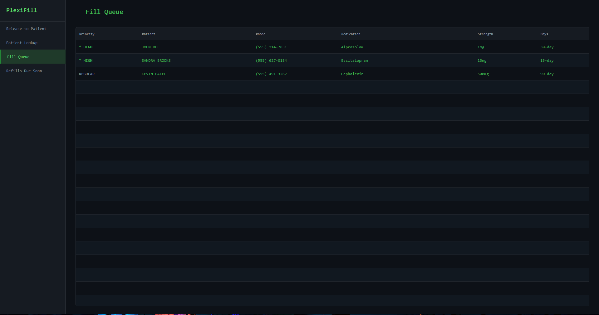
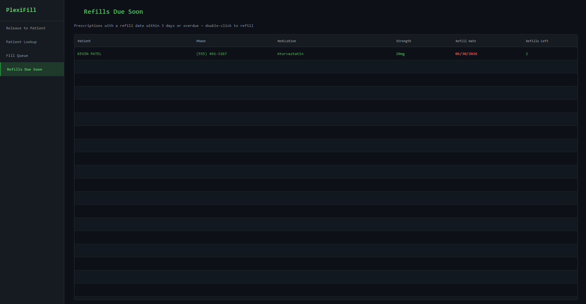
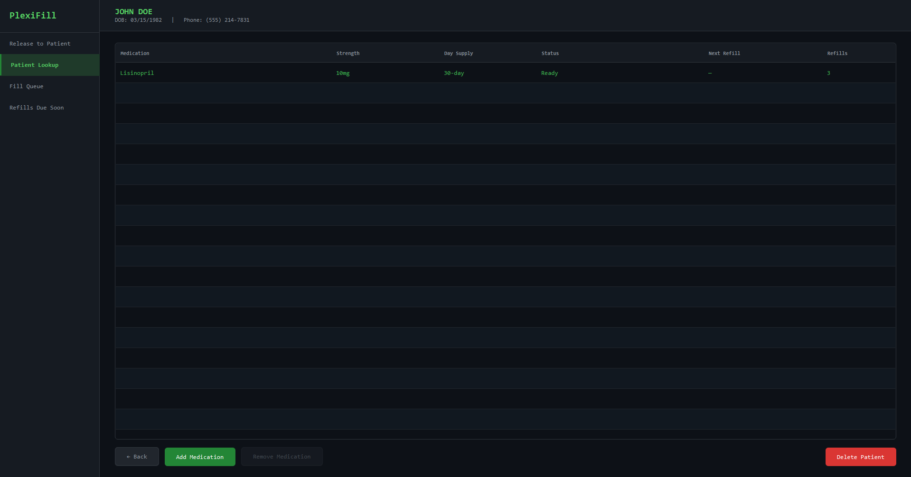
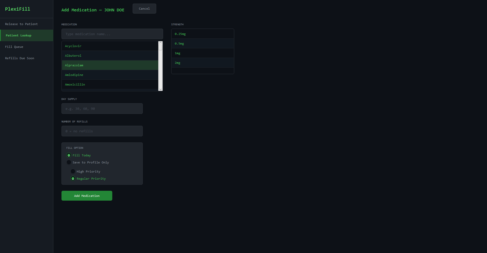
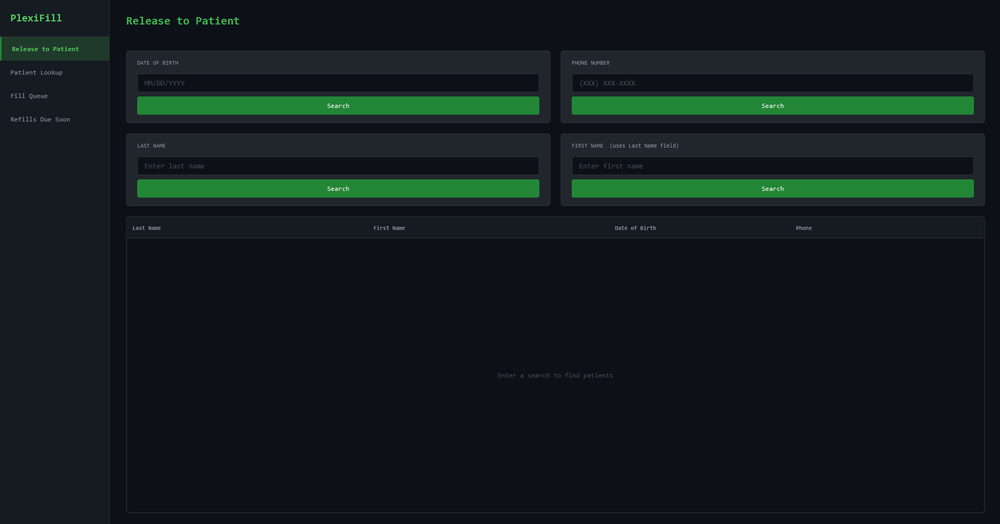

# PlexiFill — Pharmacy Management System

A JavaFX desktop application that models the day-to-day workflow of a retail pharmacy —
registering patients, adding prescriptions, working a prioritized fill queue, releasing
medications at pickup, and tracking upcoming refills. Built in Java with a clean layered
architecture and a custom-themed GUI.


<!-- Hero image: the Fill Queue screen, showing the priority-ordered queue. -->

## Overview

PlexiFill manages the full lifecycle of a prescription as it moves through a pharmacy.
A pharmacist can look up or register patients, attach prescriptions to them, fill those
prescriptions in priority order, hand them to patients at pickup, and see which refills
are coming due. All data persists to CSV files, so state survives between runs.

The application is navigated through a sidebar with four main screens:

- **Release to Patient** — search for a patient and dispense their ready prescriptions.
- **Patient Lookup** — view a patient's full profile and add medications.
- **Fill Queue** — work the prioritized queue of prescriptions waiting to be filled.
- **Refills Due Soon** — see prescriptions whose refill date is near or overdue, and send
  them back into the fill queue.

## Features

- **Patient management** — register patients and search by last name, first + last name,
  date of birth, or phone number (prefix matching supported). Families can share a single
  phone number, while duplicate registrations of the same person are detected and blocked.
- **Prescription lifecycle** — every prescription moves through four states:
  `On File → In Queue → Ready → Picked Up`.
- **Prioritized fill queue** — a custom priority queue serves high-priority prescriptions
  before regular ones while preserving first-in-first-out order within each tier.
- **Release to patient** — dispense ready prescriptions and automatically schedule the
  next available refill date based on the day supply.
- **Refills due soon** — a report of prescriptions whose next refill falls within the next
  three days (or is overdue), with refill dates color-coded by urgency.
- **CSV persistence** — patients, prescriptions, and medications load on startup and save
  on every change, using a hand-written CSV parser that handles quoted fields.

## Architecture

The project is organized into layers with clear separation of concerns:

```
pharmacy
├── model      Domain objects: Patient, Prescription, Medication, PrescriptionStatus
├── data       Persistence + data structures: CsvDataStore, PrescriptionQueue
├── service    Business logic: PatientLookupService (orchestrates data + queue)
└── ui
    ├── gui     JavaFX interface: PharmacyApp, MainWindow, views, reusable components
    └── (console) An earlier text-based interface, kept for reference
```

- **model** holds plain domain objects with no knowledge of how they're stored or displayed.
- **data** owns persistence (`CsvDataStore`) and the in-memory `PrescriptionQueue` data
  structure. `CsvDataStore` also maintains a `HashMap` index of phone number → patients for
  O(1) lookups.
- **service** (`PatientLookupService`) is the single entry point the UI talks to. It
  coordinates the data store and the fill queue and enforces business rules.
- **ui/gui** contains the JavaFX screens and is the only layer that handles input/output.
  Notably, the GUI talks exclusively to the service layer and never touches persistence
  directly — the architectural boundary holds in practice, not just on paper.

### Design highlight: the priority fill queue

`PrescriptionQueue` is implemented with two `ArrayDeque`s — one for high-priority
prescriptions and one for regular ones. New prescriptions are added to the back of the
appropriate deque, and the queue is read high-priority-first. This guarantees urgent
prescriptions are filled first while still processing each tier in the order it was
received (FIFO within a tier).

## User Interface

The GUI is styled with an external CSS stylesheet for a cohesive custom dark theme, and
includes several reusable, hand-built components:

- **`SearchPanel`** — a reusable search component (by DOB, last name, first + last name, or
  phone) shared between the Release and Lookup screens, with inputs that auto-format dates
  and phone numbers as you type.
- **`Toast`** — a lightweight animated notification system with fade-in/out transitions for
  success and error messages.
- **Custom `TableView` cell factories** — color-code prescription priority and flag refill
  dates by urgency (overdue/today, tomorrow, and upcoming).
- **Styled modal dialogs** — confirmation dialogs for filling and refilling prescriptions.

## AI-Assisted Development

AI tools were used as part of the development workflow for this project. Specifically, AI
assisted with:

- **Frontend development** — generating and iterating on the JavaFX views and CSS styling,
  which I then reviewed, integrated, and adjusted to fit the application's architecture.
- **Debugging** — diagnosing runtime errors and identifying workarounds for JavaFX-specific
  issues.
- **Code readability** — refactoring for clearer naming, structure, and formatting.
- **Light editing** — small cleanups and consistency passes across files.

The core design — the layered architecture, the priority-queue data structure, the
prescription lifecycle, and the persistence model — was my own, and I can explain how every
part of the codebase works. AI was used as a productivity tool under my direction, the same
way it's used in modern professional development.

## Screenshots

| Refills Due Soon | Patient Lookup |
|------------------|----------------|
|  |  |

| Add Medication | Release to Patient |
|----------------|--------------------|
|  |  |

## Tech Stack

- **Language:** Java
- **UI:** JavaFX, styled with an external CSS stylesheet
- **Persistence:** CSV files (no external database)
- **Core libraries:** Java standard library (`java.time`, collections)

## Project Structure

```
src/
└── pharmacy/
    ├── Main.java
    ├── model/
    │   ├── Patient.java
    │   ├── Prescription.java
    │   ├── Medication.java
    │   └── PrescriptionStatus.java
    ├── data/
    │   ├── CsvDataStore.java
    │   └── PrescriptionQueue.java
    ├── service/
    │   └── PatientLookupService.java
    └── ui/
        ├── gui/
        │   ├── PharmacyApp.java
        │   ├── MainWindow.java
        │   ├── SearchPanel.java
        │   ├── Toast.java
        │   ├── ReleaseToPatientView.java
        │   ├── PatientLookupView.java
        │   ├── FillQueueView.java
        │   ├── RefillsDueSoonView.java
        │   ├── AddPatientView.java
        │   └── style.css
        └── (console interface classes)
data/
├── patients.csv
├── prescriptions.csv
└── medications.csv
```

## Data Files

The app reads and writes three CSV files in the `data/` directory:

| File | Columns |
|------|---------|
| `patients.csv` | `firstName, lastName, dateOfBirth, phoneNumber` |
| `prescriptions.csv` | `patientPhone, medicationName, strength, daySupply, status, priority, refillDate, pickupDate, refillsRemaining` |
| `medications.csv` | `name, strengths` |

## Getting Started

### Prerequisites
- **JDK 21 or higher**
- **Apache Maven**
- The **JavaFX SDK** (JavaFX dependencies are managed through the Maven build)

### Run

The project is built with Maven and uses the JavaFX Maven plugin, so it can be launched
with a single command:

```bash
mvn javafx:run
```

Make sure the `data/` directory (with the CSV files above) is present in the working
directory, since the app loads from and saves to it on startup.

## Possible Improvements

- Add unit tests for the service and queue logic.
- Replace CSV storage with a relational database (e.g. SQLite) and a proper schema.
- Add an audit log of dispensing actions.

## About

Built by Daniel Ramiscal as a personal project to model a real pharmacy workflow in Java,
with an emphasis on clean layered design, a hand-built priority queue, and a polished
JavaFX interface.
